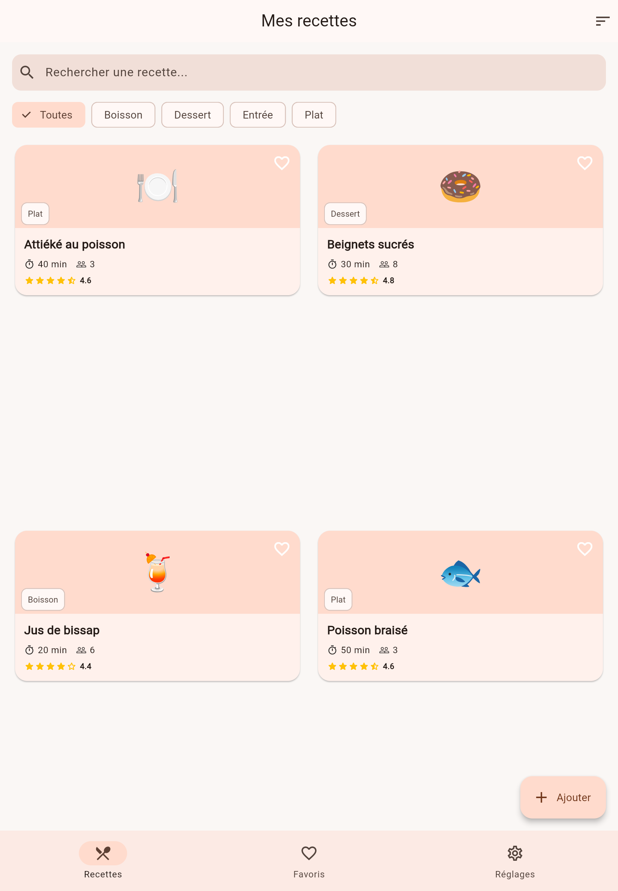
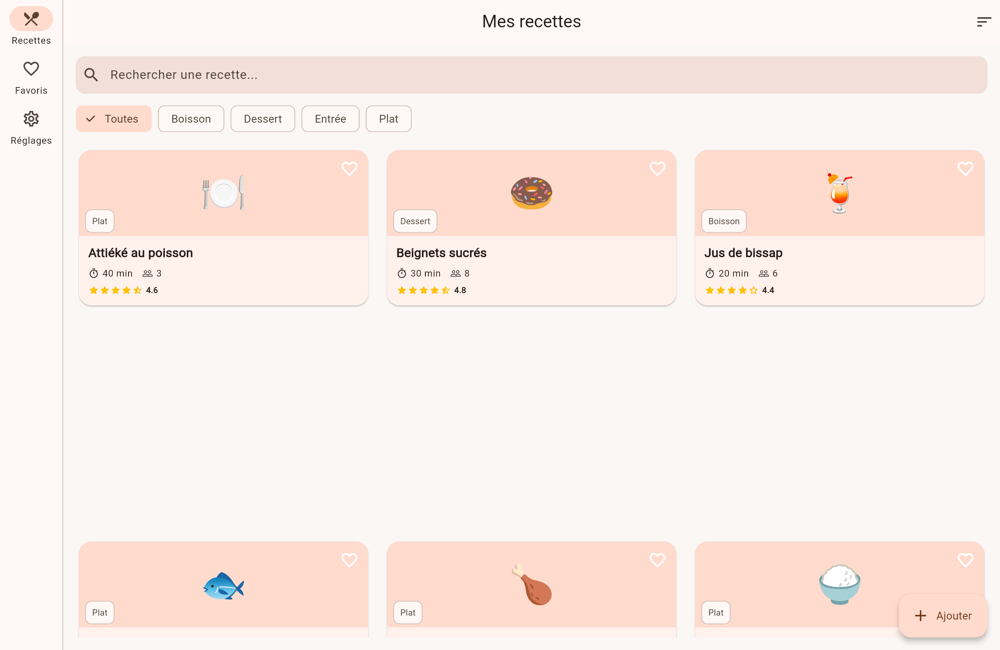

# 🍲 App Recettes — Projet Flutter multi-écrans (v2)

Application Flutter de démonstration : gestion d'un carnet de recettes,
avec navigation multi-écrans (GoRouter), recherche/filtrage/tri,
formulaire d'ajout **et de modification** avec validation, favoris et
suppression persistants, et thème clair/sombre/système. Conçue pour
valider la maîtrise des widgets Flutter et de la navigation.

> Cette version améliore la v1 (soumission initiale) avec de la
> persistance locale, un CRUD complet (ajout/modification/suppression),
> une navigation adaptative (mobile → desktop) et des tests
> automatisés. Détail des changements en fin de document.

## ✨ Fonctionnalités

- **6 écrans distincts** : Accueil (liste), Favoris, Réglages, Détail
  d'une recette, Formulaire (ajout **et** édition), page 404.
- **Navigation avec GoRouter** (routes nommées : `home`, `detail`,
  `add`), passage de paramètres d'URL (`/recipe/:id`) et passage
  d'objet via `extra` (recette à éditer).
- **Recherche, filtrage par catégorie et tri** (nom, durée, note) sur
  l'écran d'accueil.
- **CRUD complet** : ajouter, modifier et supprimer une recette
  (suppression par glissement avec "Annuler", ou depuis l'écran de
  détail avec confirmation).
- **Favoris persistants** (survivent au redémarrage de l'app), avec
  retrait par glissement et "Annuler" via SnackBar.
- **Thème clair / sombre / système**, persistant, réglable depuis
  l'écran Réglages.
- **Interface responsive à 3 niveaux** :
  - mobile → liste verticale + barre de navigation en bas ;
  - tablette (≥ 600 px) → grille 2 colonnes ;
  - grand écran / desktop (≥ 840 px) → grille 3 colonnes **et**
    barre de navigation latérale (`NavigationRail`) au lieu de la
    barre du bas.
- **Route d'erreur (404)** si un lien ne correspond à aucun écran.
- **Tests automatisés** (recherche, navigation, affichage).

## 🧱 Widgets utilisés (≥ 8 types différents)

`ListView`, `GridView`, `Stack`, `Card`, `Chip` / `ChoiceChip`,
`TextFormField`, `DropdownButtonFormField`, `NavigationBar`,
`NavigationRail`, `CustomScrollView` / `SliverAppBar`, `RadioListTile`,
`FloatingActionButton`, `IndexedStack`, `Dismissible`, `PopupMenuButton`,
`AlertDialog`, `SnackBar` avec `SnackBarAction`, entre autres.

## ♻️ Widgets réutilisables (`lib/widgets/`)

| Widget | Rôle |
|---|---|
| `RecipeCard` | Carte d'une recette (liste et grille) |
| `SearchFilterBar` | Barre de recherche + filtres catégorie |
| `CategoryChip` | Puce de filtre réutilisée par la barre de recherche |
| `RatingStars` | Affichage d'une note en étoiles |
| `EmptyState` | État vide (aucun résultat / aucun favori) |

## 🗂️ Structure du projet

```
lib/
├── main.dart                    # Point d'entrée, init persistance, MaterialApp.router
├── models/
│   └── recipe.dart              # Modèle de données Recipe
├── data/
│   ├── recipe_repository.dart   # Source des recettes + CRUD (aucune donnée en dur dans l'UI)
│   └── favorites_controller.dart# Favoris, persistés avec shared_preferences
├── theme/
│   ├── app_theme.dart           # Thèmes clair / sombre
│   └── theme_controller.dart    # Choix de thème, persisté avec shared_preferences
├── router/
│   └── app_router.dart          # Configuration GoRouter (routes nommées + 404)
├── screens/
│   ├── main_screen.dart         # Conteneur adaptatif (NavigationBar / NavigationRail)
│   ├── home_tab.dart            # Liste + recherche + filtrage + tri + swipe-to-delete
│   ├── favorites_tab.dart       # Favoris + swipe pour retirer
│   ├── settings_tab.dart        # Thème clair/sombre/système
│   ├── recipe_detail_screen.dart# Détail (paramètre d'URL) + modifier/supprimer
│   ├── recipe_form_screen.dart  # Formulaire d'ajout ET d'édition avec validation
│   └── not_found_screen.dart    # Écran 404 (route GoRouter inconnue)
└── widgets/
    ├── recipe_card.dart
    ├── search_filter_bar.dart
    ├── category_chip.dart
    ├── rating_stars.dart
    └── empty_state.dart
test/
└── widget_test.dart             # Tests : recherche, filtrage, navigation vers le détail
```

La séparation UI / données est stricte : les widgets et écrans ne
contiennent aucune recette codée en dur — tout passe par
`RecipeRepository`, qui joue le rôle d'une source de données (à terme
remplaçable par un appel API ou une base locale sans toucher à l'UI).

## 🚀 Installation et lancement

### Prérequis

- [Flutter SDK](https://docs.flutter.dev/get-started/install) ≥ 3.22
  (Dart ≥ 3.3)
- Un appareil, un émulateur, ou un navigateur (Flutter Web) configuré

### Étapes

```bash
# 1. Cloner le dépôt
git clone <url-de-votre-repo>
cd recipes_app

# 2. Installer les dépendances
flutter pub get

# 3. Vérifier que tout est en ordre
flutter doctor

# 4. Lancer l'application (sur l'appareil/émulateur connecté)
flutter run

# ... ou cibler une plateforme précise
flutter run -d chrome     # Web
flutter run -d macos      # macOS
flutter run -d windows    # Windows
```

### Lancer les tests

```bash
flutter test
```

### Générer un build de production

```bash
flutter build apk           # Android
flutter build ios           # iOS (nécessite Xcode)
flutter build web           # Web
```

## 📱 Captures d'écran

> Ajoutez ici vos captures une fois l'application lancée, par exemple
> dans un dossier `screenshots/` :
>
> ```markdown
> | Accueil | Détail | Formulaire | Réglages |
> |---|---|---|---|
> |  |  |  |  |
>
> | Mobile | Tablette | Desktop (NavigationRail) |
> |---|---|---|
> |  |  |  |
> ```

## 🛠️ Technologies

- **Flutter** (Material 3)
- **go_router** — navigation déclarative avec routes nommées, routes
  paramétrées et gestion des routes inconnues
- **shared_preferences** — persistance locale légère (thème, favoris)
- Gestion d'état simple via `ChangeNotifier` (pas de dépendance externe
  de state management, pour un projet facile à lire et à lancer)
- **flutter_test** — tests de widgets

## 📤 Publier ce projet sur GitHub

```bash
git init
git add .
git commit -m "Initial commit — App Recettes Flutter"
git branch -M main
git remote add origin <url-de-votre-repo-github>
git push -u origin main
```

Pensez à rendre le dépôt **public** et à ajouter vos captures d'écran
avant de soumettre le lien.

## 📝 Changements par rapport à la v1

- ✅ Persistance des favoris et du thème (`shared_preferences`) —
  l'état survit au redémarrage de l'app.
- ✅ Modification d'une recette existante (le formulaire d'ajout
  devient un formulaire d'ajout/édition réutilisé via `extra`).
- ✅ Suppression d'une recette (glissement avec "Annuler", ou bouton
  dédié sur l'écran de détail avec confirmation).
- ✅ Retrait des favoris par glissement, avec "Annuler".
- ✅ Tri de la liste (nom, durée, note) via `PopupMenuButton`.
- ✅ Écran 404 (`errorBuilder` de GoRouter) pour les routes inconnues.
- ✅ Navigation adaptative : `NavigationRail` sur grand écran /
  desktop, `NavigationBar` sur mobile et tablette.
- ✅ Tests automatisés de base (`flutter test`).
