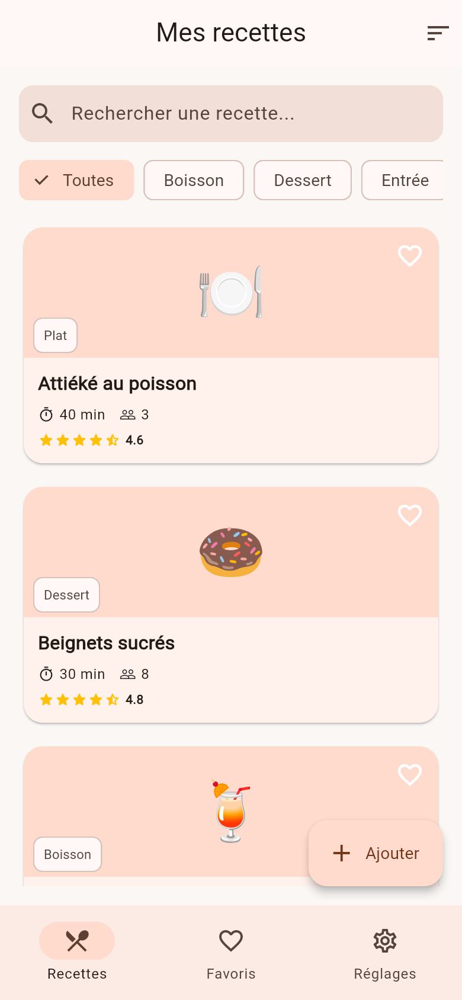
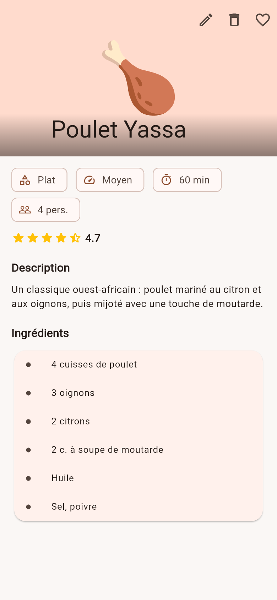
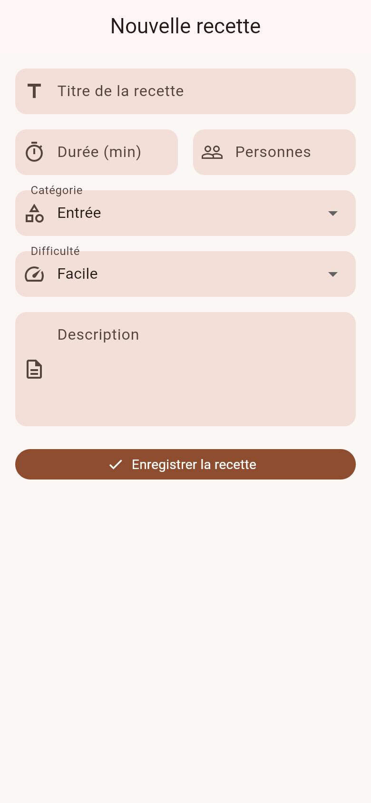
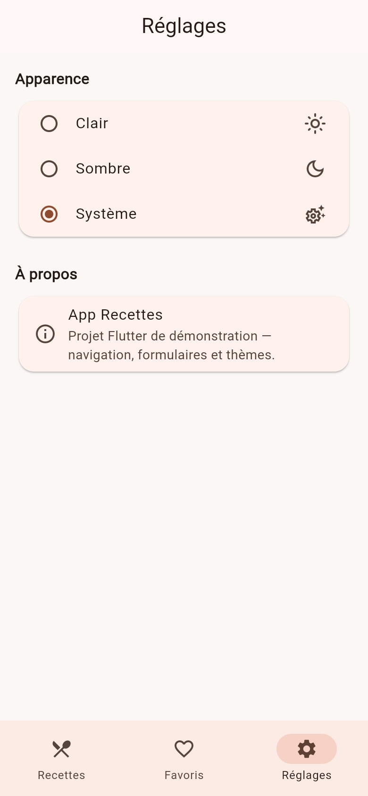

#  App Recettes — Projet Flutter multi-écrans

Application Flutter de démonstration : gestion d'un carnet de recettes,
avec navigation multi-écrans (GoRouter), recherche/filtrage, formulaire
avec validation, favoris, et thème clair/sombre. Conçue pour valider la
maîtrise des widgets Flutter et de la navigation.

##  Fonctionnalités

- **5 écrans distincts** : Accueil (liste), Favoris, Réglages, Détail
  d'une recette, Formulaire d'ajout.
- **Navigation avec GoRouter** (routes nommées : `home`, `detail`, `add`)
  et passage de paramètres (`/recipe/:id`) vers l'écran de détail.
- **Recherche + filtrage par catégorie** sur l'écran d'accueil.
- **Formulaire de 6 champs avec validation** (titre, durée, nombre de
  personnes, catégorie, difficulté, description).
- **Favoris** persistants pendant la session (cœur sur chaque carte).
- **Thème clair / sombre / système**, réglable depuis l'écran Réglages.
- **Interface responsive** : liste verticale sur mobile, grille à 2 ou
  3 colonnes sur tablette (`LayoutBuilder`).

##  Widgets utilisés (≥ 8 types différents)

`ListView`, `GridView`, `Stack`, `Card`, `Chip` / `ChoiceChip`,
`TextFormField`, `DropdownButtonFormField`, `NavigationBar`,
`CustomScrollView` / `SliverAppBar`, `RadioListTile`,
`FloatingActionButton`, `IndexedStack`, entre autres.

##  Widgets réutilisables (`lib/widgets/`)

| Widget | Rôle |
|---|---|
| `RecipeCard` | Carte d'une recette (liste et grille) |
| `SearchFilterBar` | Barre de recherche + filtres catégorie |
| `CategoryChip` | Puce de filtre réutilisée par la barre de recherche |
| `RatingStars` | Affichage d'une note en étoiles |
| `EmptyState` | État vide (aucun résultat / aucun favori) |

##  Structure du projet

```
lib/
├── main.dart                    # Point d'entrée, MaterialApp.router
├── models/
│   └── recipe.dart              # Modèle de données Recipe
├── data/
│   ├── recipe_repository.dart   # Source des recettes (aucune donnée en dur dans l'UI)
│   └── favorites_controller.dart
├── theme/
│   ├── app_theme.dart           # Thèmes clair / sombre
│   └── theme_controller.dart
├── router/
│   └── app_router.dart          # Configuration GoRouter (routes nommées)
├── screens/
│   ├── main_screen.dart         # Conteneur avec barre de navigation
│   ├── home_tab.dart            # Liste + recherche + filtrage
│   ├── favorites_tab.dart       # Favoris
│   ├── settings_tab.dart        # Thème clair/sombre
│   ├── recipe_detail_screen.dart# Détail (paramètre d'URL)
│   └── add_recipe_screen.dart   # Formulaire avec validation
└── widgets/
    ├── recipe_card.dart
    ├── search_filter_bar.dart
    ├── category_chip.dart
    ├── rating_stars.dart
    └── empty_state.dart
```

La séparation UI / données est stricte : les widgets et écrans ne
contiennent aucune recette codée en dur — tout passe par
`RecipeRepository`, qui joue le rôle d'une source de données (à terme
remplaçable par un appel API ou une base locale sans toucher à l'UI).

##  Installation et lancement

### Prérequis

- [Flutter SDK](https://docs.flutter.dev/get-started/install) ≥ 3.22
  (Dart ≥ 3.3)
- Un appareil, un émulateur, ou un navigateur (Flutter Web) configuré

### Étapes

```bash
# 1. Cloner le dépôt
git clone <url-de-votre-repo>
cd recipes_app

# 2. Installer les dépendances
flutter pub get

# 3. Vérifier que tout est en ordre
flutter doctor

# 4. Lancer l'application (sur l'appareil/émulateur connecté)
flutter run

# ... ou cibler une plateforme précise
flutter run -d chrome     # Web
flutter run -d macos      # macOS
flutter run -d windows    # Windows
```

### Générer un build de production

```bash
flutter build apk           # Android
flutter build ios           # iOS (nécessite Xcode)
flutter build web           # Web
```

##  Captures d'écran

> Ajoutez ici vos captures une fois l'application lancée, par exemple
> dans un dossier `screenshots/` :
>
> ```markdown
> | Accueil | Détail | Formulaire | Réglages |
> |---|---|---|---|
> |  |  |  |  |
> ```

##  Technologies

- **Flutter** (Material 3)
- **go_router** — navigation déclarative avec routes nommées
- Gestion d'état simple via `ChangeNotifier` (pas de dépendance externe
  de state management, pour un projet facile à lire et à lancer)

##  Publier ce projet sur GitHub

```bash
git init
git add .
git commit -m "Initial commit — App Recettes Flutter"
git branch -M main
git remote add origin <url-de-votre-repo-github>
git push -u origin main
```

Pensez à rendre le dépôt **public** et à ajouter vos captures d'écran
avant de soumettre le lien.
